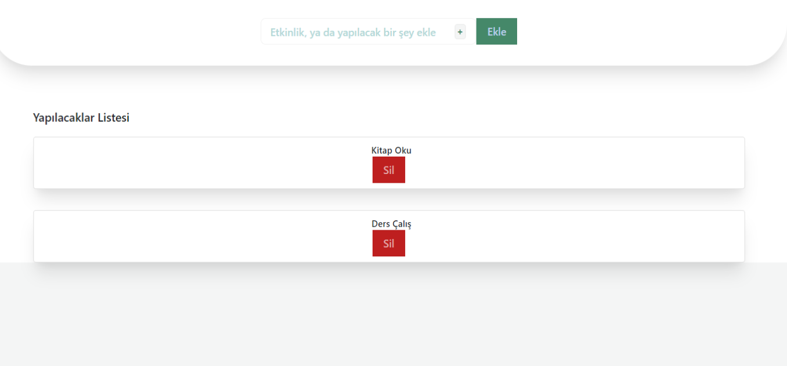

## To do List Yapımı

* Element eklemeyi sağlayan bir fonksiyon, 
* Element silmeyi sağlayan bir fonksiyon,
* Yapıldı şeklinde işaretlenmesini sağlayan bir fonksiyon oluşturuldu.

* Element eklendiğinde hata verilen toast yapısı oluşturuldu.

* Listeye boş karakter eklenemiyor. Bununla birlikte hiçbir şey yazılmadığında da aynı hatayı veriyor.

* Yaptığımız çalışma LocalStorage eklendi. Ve verilerin kaybolmaması sağlandı.